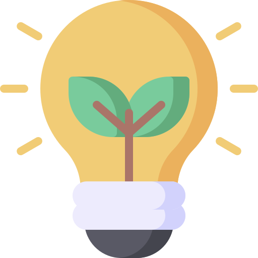

# clean-energy-mini-game

[![LinkedIn][linkedin-shield]][linkedin-url]

<!-- PROJECT LOGO -->
 

  

<h3 align="center">Clean Energy</h3>

  

Simple mini-game made for the Sustainability Awareness Week

  

 
 
 <a href="https://victorcappa.itch.io/clean-energy-mini-game" target="_blank">Demo can be played here<a/>
 

<!-- ABOUT THE PROJECT -->
## About The Project

 

 
  

(<a href="#top">back to top</a>)

<!-- LICENSE -->
## License

Distributed under the MIT License. See `LICENSE.txt` for more information.

(<a href="#top">back to top</a>)

<!-- CONTACT -->
## Contact

Reach out - <a href = "mailto: cappacurta@gmail.com.com">Victor Cappa</a>

Share the project - [Clean Energy](https://github.com/victorcappa/clean-energy-mini-game)

(<a href="#top">back to top</a>)

[linkedin-shield]: https://img.shields.io/badge/-LinkedIn-black.svg?style=for-the-badge&logo=linkedin&colorB=555
[linkedin-url]: https://www.linkedin.com/in/victor-cappa-50839788/
